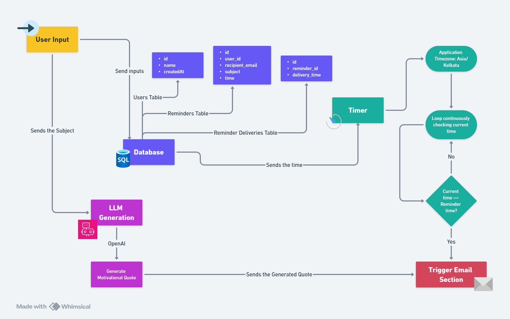

# mail-automation
Send minute-precise emails with a short, original quote on the chosen topic.  
Built in Python with MySQL for storage, Gmail SMTP for delivery, and OpenAI for 1-line quotes (with a safe local fallback).

## Features
- Exact-minute scheduler: checks every minute and sends at HH:MM in your app timezone.  
- Topic → 1-line quote: calls OpenAI to generate a ≤120-char line; falls back to a local quote bank if the API fails.  
- Once-per-day protection: prevents duplicate sends for the same reminder on the same day.  
- Simple CLI insert: add a user + reminder via prompts.  
- Timezone aware: set APP_TZ (e.g., Asia/Kolkata) via `.env`.  
- Gmail SMTP: supports STARTTLS (587) and SSL (465) using a Gmail App Password.  

## Requirements
- Python 3.10+ (for `zoneinfo`)  
- MySQL 8.x (or compatible)  
- A Gmail account + App Password (not your regular password)  
- OpenAI API key (optional; the app falls back to local quotes if missing)  

## Database Schema
'''
Create a database (e.g., reminder_app) and three tables:

CREATE TABLE users (
  id   INT AUTO_INCREMENT PRIMARY KEY,
  name VARCHAR(100) NOT NULL
);

CREATE TABLE reminders (
  id             INT AUTO_INCREMENT PRIMARY KEY,
  user_id        INT NOT NULL,
  subject        VARCHAR(200) NOT NULL,  -- the "topic" for the quote
  time_hhmm      CHAR(5) NOT NULL,       -- 'HH:MM' 24h
  recipient_email VARCHAR(255) NOT NULL,
  FOREIGN KEY (user_id) REFERENCES users(id)
);

CREATE TABLE reminder_deliveries (
  id          INT AUTO_INCREMENT PRIMARY KEY,
  reminder_id INT NOT NULL,
  delivered_on DATE NOT NULL,
  created_at   TIMESTAMP DEFAULT CURRENT_TIMESTAMP,
  UNIQUE KEY unique_once_per_day (reminder_id, delivered_on),
  FOREIGN KEY (reminder_id) REFERENCES reminders(id)
);
'''

## Environment Variables (.env)

Create a .env in the project root:
'''
# App
APP_TZ=Asia/Kolkata
RUN_SCHEDULER_AFTER_INSERT=false

# MySQL
DB_HOST= host_name
DB_PORT=post_name        
DB_USER=user_name
DB_PASS= pasword
DB_NAME= db_name

# SMTP (Gmail)
SMTP_HOST=smtp.gmail.com
SMTP_PORT=587       # 587 (STARTTLS) or 465 (SSL)
SMTP_USER=you@gmail.com
SMTP_PASS=your_16_char_gmail_app_password
FROM_EMAIL=you@gmail.com

# OpenAI
OPENAI_API_KEY=sk-...
'''
Gmail App Password: In your Google Account → Security → 2-Step Verification → App passwords → create one for “Mail”. Use that 16-char value as SMTP_PASS.

## Add a reminder via CLI (example)
The script prompts:

- Name: Olivia
- Topic (saved as subject): Money
- Send time HH:MM: 19:22
- Recipient email: hello@gmail.com

If RUN_SCHEDULER_AFTER_INSERT=true, the exact-minute loop starts immediately.
Otherwise, you can start the loop manually (e.g., run_exact_minute_loop(stop_after_first_send=True) during testing).

## How it works (high level)

- Insert a reminder (user + topic + HH:MM + recipient).
- Every minute, the loop:
- Grabs matching reminders for the current HH:MM and app timezone.
- Skips any already sent today (via reminder_deliveries).
- Tries to generate a quote (≤120 chars) using OpenAI; falls back to a local quote bank if API fails.
- Emails the recipient (Gmail SMTP).
- Logs the send in reminder_deliveries.

## Configuration Notes

SMTP_PORT=587 → STARTTLS; SMTP_PORT=465 → SSL block.
Valid time format is strict HH:MM (00:00–23:59) via a regex guard.
Quote length is clipped to ≤120 chars.
If OpenAI is unavailable or returns bad text, a local, clean quote is used.

